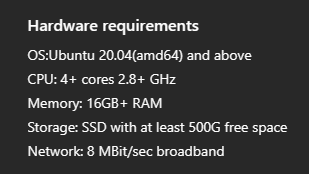
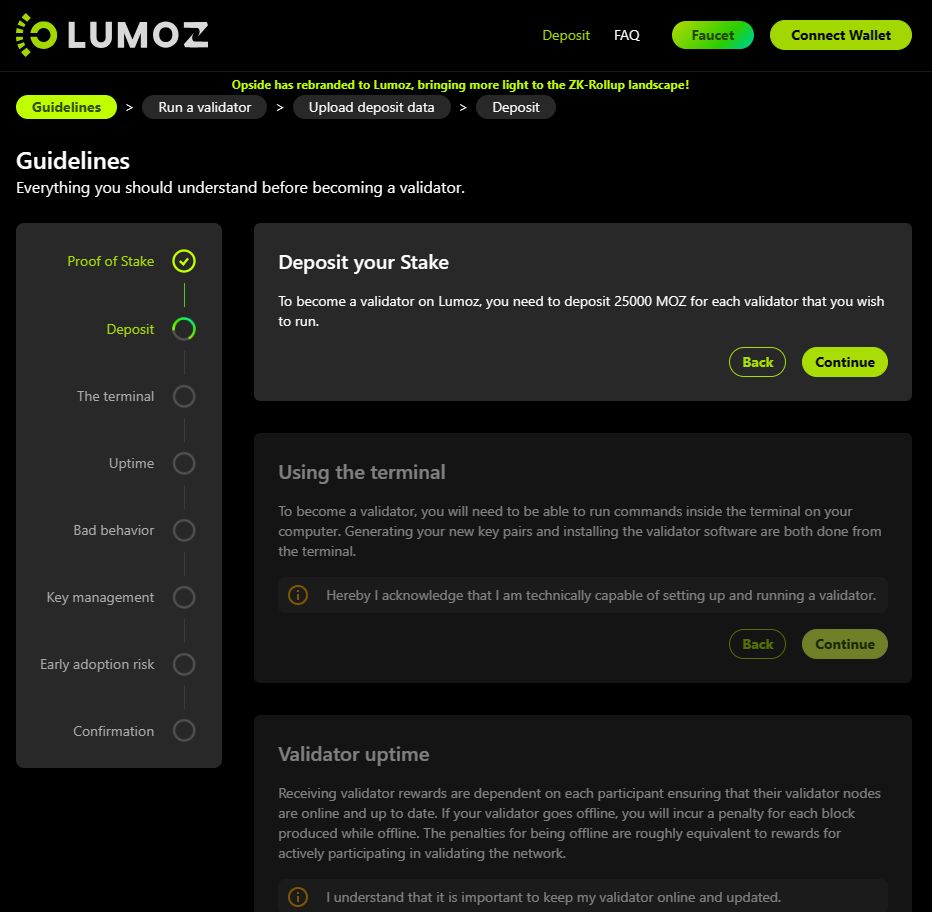
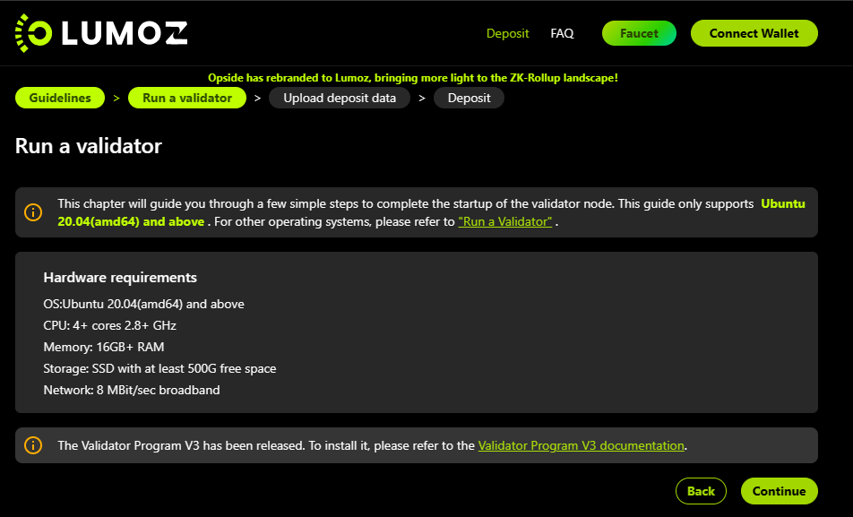
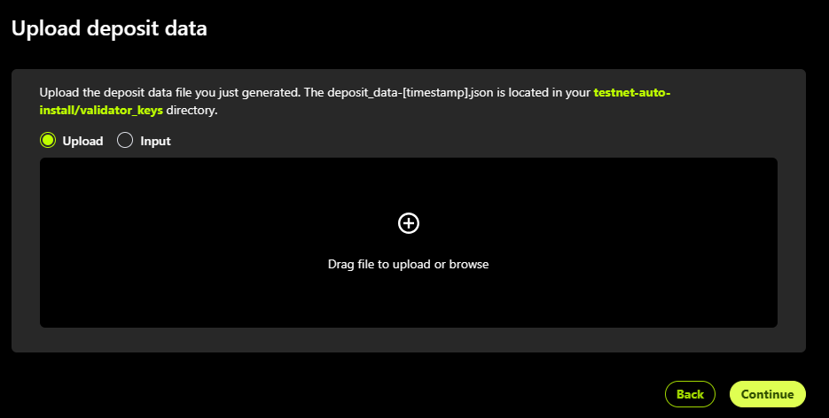

# Run Node Lumoz

## Recommended Hardware Requirements 

## Create wallet & Setup Node
### 1/ Install and run the program
```
wget -c https://pre-alpha-download.opside.network/testnet-auto-install-v3.tar.gz && tar -C ./ -xzf testnet-auto-install-v3.tar.gz && chmod +x -R ./testnet-auto-install-v3 && cd ./testnet-auto-install-v3 && ./install-ubuntu-1.0.sh
```
### 2/ Select Sync Mode
```
Please choose the synchronization mode you need: 
 1. Fast mode {synchronization is fast, recommended, if there is a synchronization error, you can try to switch to normal mode}
 2. Normal mode {more nodes, more stable, but slower}
Enter index[1]:
//Enter index to choose a Sync Mode, EFast mode is default
```
- Select: 1
### 3/ Select the mnemonic import type
```
Select the mnemonic import type: 
 1. Create a new mnemonic
 2. Import an existing mnemonic
Enter index[1]:
//Enter index to choose the mnemonic import type, "Create a new mnemonic" is default
```
### Create a new mnemonic
Follow the CLI prompts to generate your keys.
### Import an existing mnemonic
Follow the CLI prompts to generate your keys. 

When you come to
```
Please enter your mnemonic separated by spaces (" "). Note: you only need to enter the first 4 letters of each word if you'd prefer.:
```
After inputting your existing mnemonic, you will see
```
Enter the index (key number) you wish to start generating more keys from. For example, if you've generated 4 keys in the past, you'd enter 4 here. [0]:
```
If you ever generated keys from the mnemonic, assuming 5 validator keys，their indexs are '0','1','2','3','4', you can choose the exsisting validator key(such as index 1) if you want to migrate your validator. Or that you can create a new validator key by inputing the index '5', you will have a new validator key which is generated from the mnemonic
### 4/ Upload deposit data
You don't need deposit again if you use an exsiting validator key you have deposited to. 
- [BECOME A VALIDATOR HERE](https://lumoz.org/validator)





- Upload the deposit data file you just generated. The deposit_data-[timestamp].json is located in your `testnet-auto-install/validator_keys directory`



### 5/ Check logs node
```
# show the execution client logs
testnet-auto-install-v3/opside-chain/show-geth-log.sh

# show the consensus client logs
testnet-auto-install-v3/opside-chain/show-beaconChain-log.sh

# show the validator logs
testnet-auto-install-v3/opside-chain/show-validator-log.sh
```